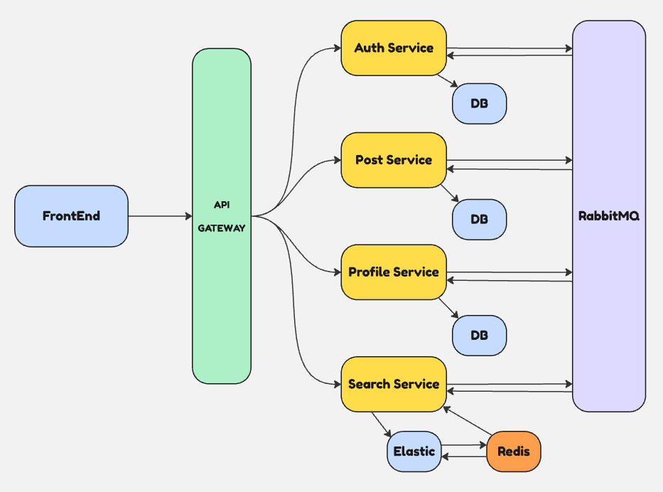
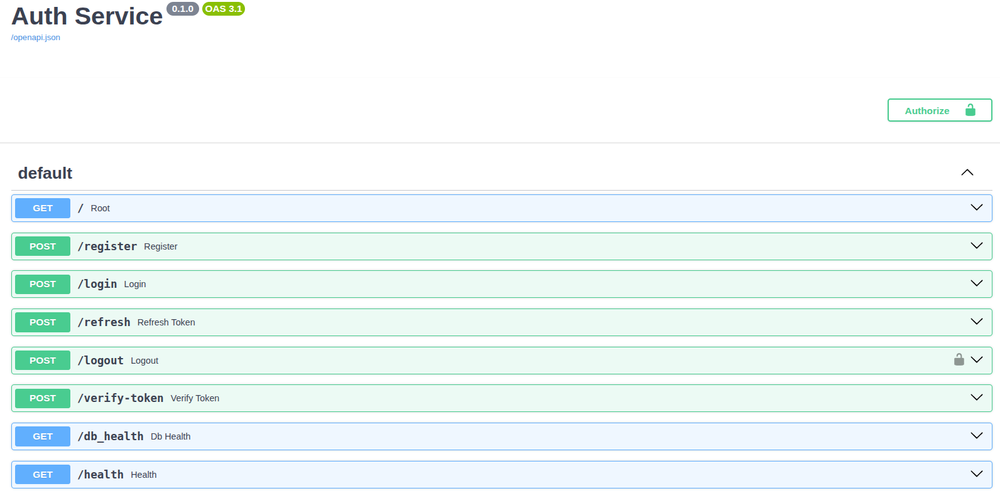
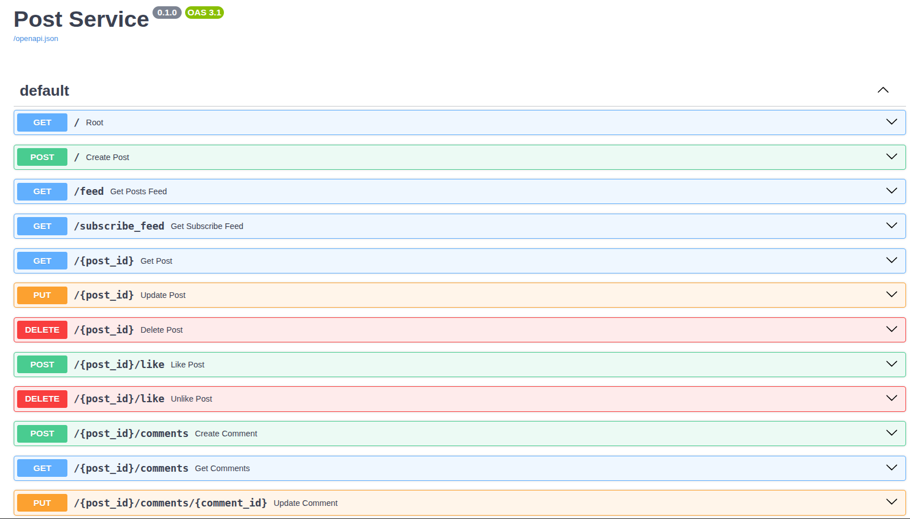
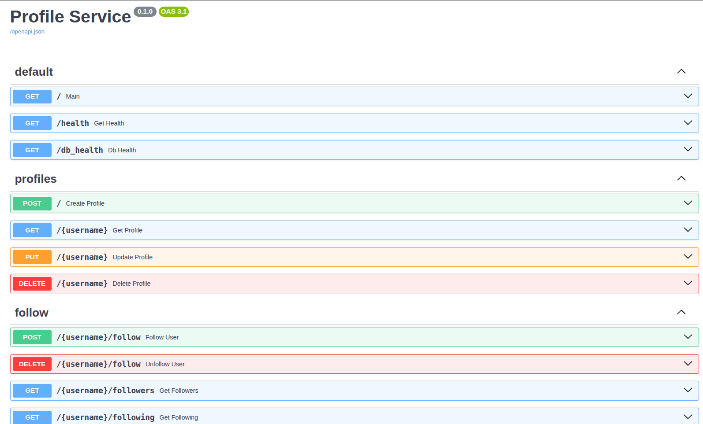
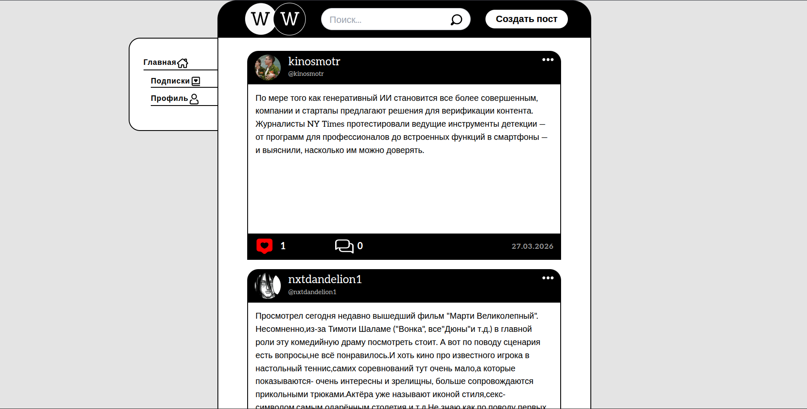
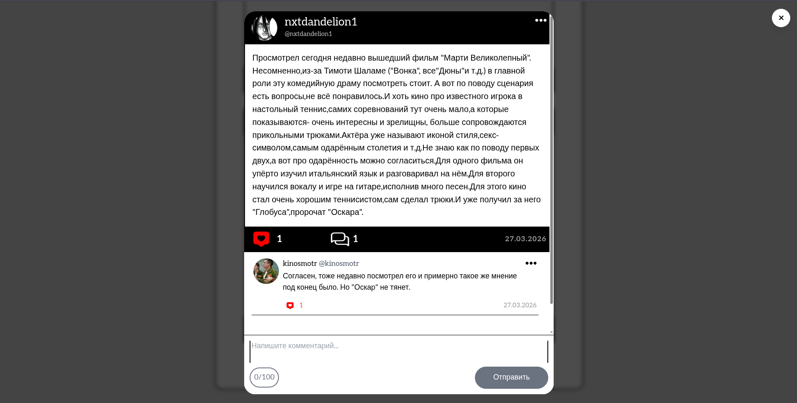
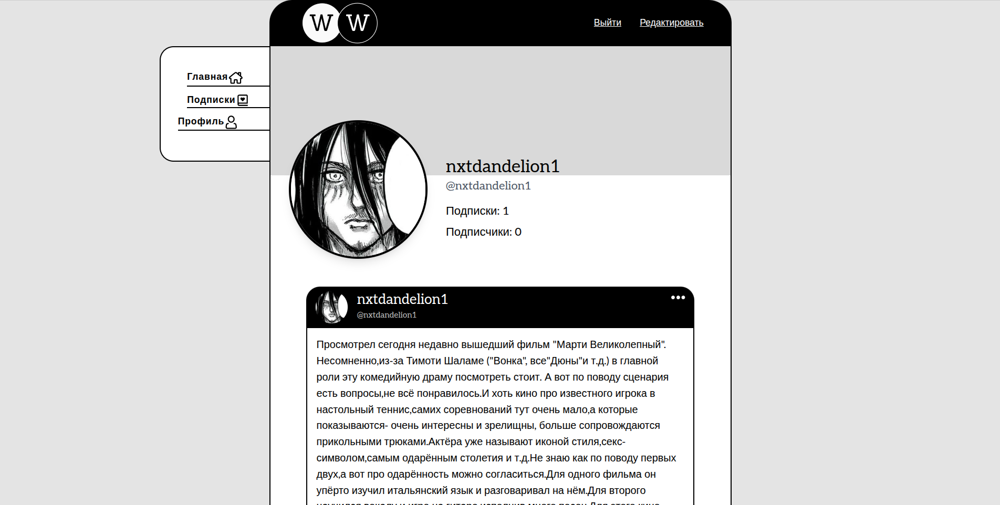
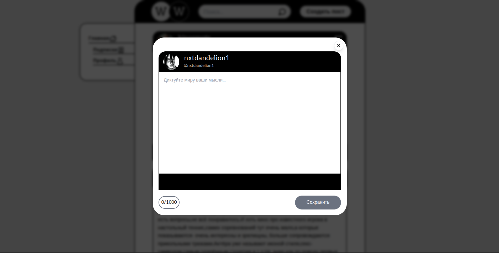

> [!WARNING]
> 
> **Social-Network W** - упрощенный аналог платформы X (ранее Twitter), разработанный командой из 5 человек в рамках **учебного**
> курсового проекта.
> 
> Проект демонстрирует микросервисную архитектуру с полным циклом CI/CD, контейнеризацией и тестированием.

# Упрощенная схема архитектуры проекта

## Компоненты системы
| Компонент      | Стек                                   | Описание                                                        |
|----------------|----------------------------------------|-----------------------------------------------------------------|
| Gateway        | Java 21, Spring Cloud Gateway          | Единая точка входа. Маршрутизация, JWT валидация с помощью Auth |
| Auth           | Python 3.11, FastAPI, SQLAlchemy       | Регистрация, логин, выдача и верификация JWT                    |
| Post           | Python 3.11, FastAPI, SQLAlchemy       | CRUD постов, комментариев, лайков. Кэш профилей                 |
| Profile        | Python 3.11, FastAPI, SQLAlchemy       | CRUD профилей, синхронизация с Auth. Кэш постов                 |
| Search         | Java 21, Spring Boot, ElasticSearch    | Полнотекстовый поиск по постам и хэштегам                       |
| FrontEnd       | JavaScript (Vanilla), HTML5, CSS3      | Пользовательский интерфейс, SPA                                 |
| Message Broker | RabbitMQ 3.12                          | Асинхронное взаимодействие между сервисами                      |
| Databases      | PostgreSQL 17, ElasticSearch 8         | Персистентное хранение и поиск                                  |
| infrastructure | Docker, Docker Compose, GitHub Actions | Контейнеризация и тестирование                                  |

## Сваггеры сервисов
Auth - http://localhost:8001/docs


Post - http://localhost:8002/docs


Profile - http://localhost:8003/docs


# Интерфейс 





# Локальный быстрый старт
Клонирование репозитория
```commandline
git clone https://github.com/nxtDandelion/social-network-W.git
cd social-network-W
```
Запуск всех сервисов
```commandline
docker compose up -d
```

Проверка статуса
```commandline
docker compose ps
```

Сам сайт находится по адресу http://localhost:5173/

# Команда

- **Team Lead / Backend - Станислав Кашмак**
- **Backend / DevOps - Андрей Джичко**
- **Backend - Максим Кончев**
- **Backend - Кира Крючкова**
- **Frontend - Алексей Муратов**